[Areas of the game](AREAS.md) | [Game files](DDDFILES.md) | [Game state area](FLAGS.md)


# Maps

All map images are built by running

```
make gather
```

and can be found in the `res` directory.

## World map

The world map is shown to consist of `(39*4) * (39*4)` tiles (as can be seen in the pencil drawing of the map available on the web).
The data is stored in `DDD1/ddd.mapa` (and `DDD1/ddd.code`) and can be plotted with

```
./src/worldmap2png.py
```

The map file contains a `52 x (52*3)` data set (`52*3` == `39*4`).
Each entry represents a strip of `3*1` actual tiles (the subtiles).

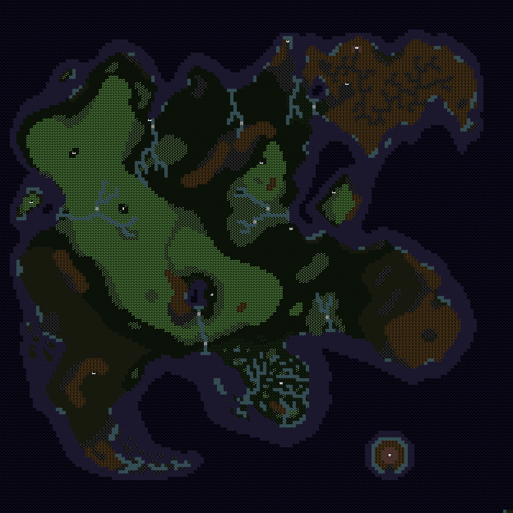

## Submaps

Most submaps of towns and castles are 35 tiles wide.

```
./src/map2png.py c64/DDD1/ddd.mapc 35
```

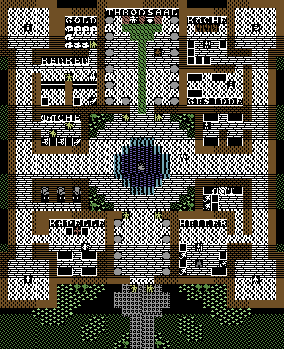
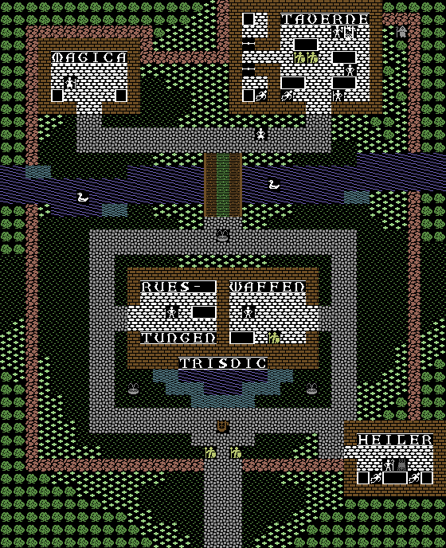
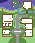
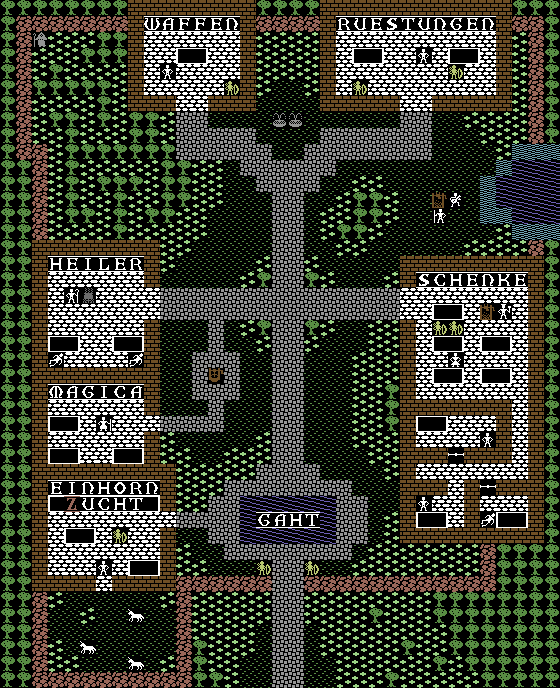
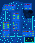
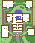


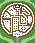
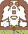


The druid cottage is 11 tiles wide.

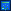

# Graphics

## Extracting palette data

Go to http://www.colodore.com/ and fine tune the palette. Click on the cog wheel
icon in the top right corner and select "PNG Format" to download the palette as
a png file. Use

```
make palette
```

to extract the color info.

## Charsets

```
make chars
```

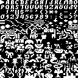
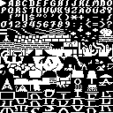
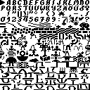
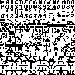
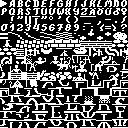
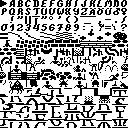
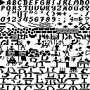
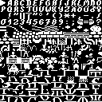
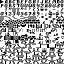
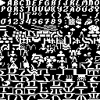
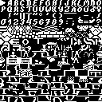
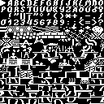
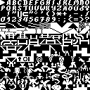
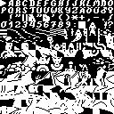
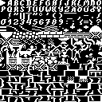
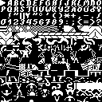

## Sprites

Only one spritesheet seems to be present and it looks like it should be a multicolor sprite

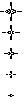
